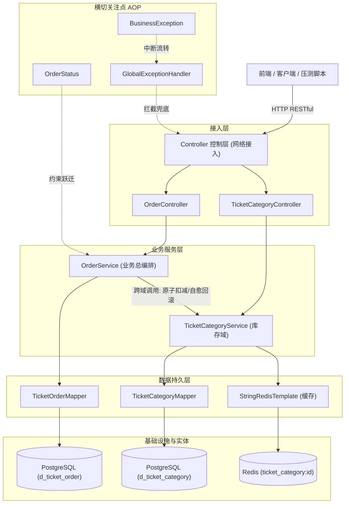

# 大麦网票务高并发订单系统——核心架构与代码设计详解

> 本文档针对当前工程的所有类、方法、字段、注解及其依赖拓扑进行深度解剖。
> 旨在从**软件架构设计哲学**、**企业级防御性编程**与**大厂社招高频考点**三个维度，让你彻底掌握每一行代码存在的理由，做到知其然更知其所以然。

---

## 目录
1. [系统整体依赖拓扑与调用链](#1-系统整体依赖拓扑与调用链)
2. [公共基建层（common 包）详解](#2-公共基建层common-包详解)
   - [2.1 统一响应封装：Result<T>](#21-统一响应封装resultt)
   - [2.2 业务受控异常：BusinessException](#22-业务受控异常businessexception)
   - [2.3 全局异常拦截器：GlobalExceptionHandler](#23-全局异常拦截器globalexceptionhandler)
   - [2.4 有限状态机枚举：OrderStatus](#24-有限状态机枚举orderstatus)
3. [领域实体层（entity 包）详解](#3-领域实体层entity-包详解)
   - [3.1 票档实体：TicketCategory](#31-票档实体ticketcategory)
   - [3.2 订单实体：TicketOrder](#32-订单实体ticketorder)
4. [数据访问层（mapper 包）详解](#4-数据访问层mapper-包详解)
   - [4.1 票档持久化：TicketCategoryMapper](#41-票档持久化ticketcategorymapper)
   - [4.2 订单持久化：TicketOrderMapper](#42-订单持久化ticketordermapper)
5. [核心业务服务层（service 包）详解](#5-核心业务服务层service-包详解)
   - [5.1 票档与库存服务：TicketCategoryService](#51-票档与库存服务ticketcategoryservice)
   - [5.2 订单编排与状态流转服务：OrderService](#52-订单编排与状态流转服务orderservice)
6. [网络接入控制层（controller 包）详解](#6-网络接入控制层controller-包详解)
   - [6.1 TicketCategoryController 与 OrderController](#61-ticketcategorycontroller-与-ordercontroller)
7. [关键设计缺陷审查与修复提示](#7-关键设计缺陷审查与修复提示)

---

## 1. 系统整体依赖拓扑与调用链

在现代分层架构中，依赖关系必须保持**单向、无环**。



### 💡 核心设计考点：为什么 OrderService 依赖 TicketCategoryService，而不是直接依赖 TicketCategoryMapper？
- **错误的做法**：在 `OrderService` 里直接注入 `TicketCategoryMapper` 去执行扣库存和回滚库存。
- **正确的架构（当前做法）**：`OrderService` 只能调用 `TicketCategoryService` 的接口。
  - **原因**：库存不仅涉及数据库的更新，还绑定了 **Redis 缓存的淘汰与一致性维护**。如果 `OrderService` 绕过 Service 直接操作 Mapper，就会导致数据库扣了库存，但 Redis 里的旧缓存没有被删掉，引发严重的**数据不一致（脏缓存）**！

---

## 2. 公共基建层（common 包）详解

### 2.1 统一响应封装：`Result<T>`
- **前置依赖**：Lombok `@Data`
- **设计目的**：前后端分离的“通信协议规范”。禁止 Controller 直接返回裸对象（如 `TicketOrder`），必须包裹在统一的 JSON 外壳中。

#### 变量解析：
- `private Integer code`: 业务状态码。
  - `200`：请求成功。
  - `400`：用户侧业务错误（如“已售罄”、“参数缺失”）。
  - `404`：目标资源不存在（如“订单ID不存在”）。
  - `500`：系统未捕获的突发内部错误。
- `private String message`: 人性化的状态描述文本，前端可直接用于 `ElMessage.error(res.message)` 弹出提示。
- `private T data`: 泛型业务载荷。成功时存放具体的订单实体或列表；失败时为 `null`。

#### 方法解析：
- `public static <T> Result<T> success(T data)`: 静态工厂方法，快速构建成功响应。
- `public static <T> Result<T> error(Integer code, String message)`: 静态工厂方法，快速构建异常返回体。

---

### 2.2 业务受控异常：`BusinessException`
- **前置依赖**：继承自 `RuntimeException`（非受检异常）
- **设计目的**：在业务逻辑发生冲突时（如库存不足、订单不存在），**中断当前的执行链路**，并由 Spring 的事务管理器感知并触发事务回滚。

#### 变量解析：
- `private final Integer code`: 伴随此异常的业务状态码（如 400、404、409）。

#### 为什么必须继承 `RuntimeException` 而不是 `Exception`？
- Spring 的 `@Transactional` 默认**只对非受检异常（RuntimeException 和 Error）进行自动事务回滚**。
- 如果继承 Checked Exception（受检异常），发生异常时 Spring 不会自动回滚事务，除非显式指定 `@Transactional(rollbackFor = Exception.class)`。

---

### 2.3 全局异常拦截器：`GlobalExceptionHandler`
- **前置依赖**：`@RestControllerAdvice`、`@ExceptionHandler`、`@Slf4j`
- **设计目的**：AOP（面向切面编程）全局异常兜底，防止代码崩溃时将未经处理的 Java 堆栈信息直接暴露给前端用户（既不美观，又存在安全隐患）。

#### 方法解析：
- `handleBusinessException(BusinessException e)`:
  - 专门捕获程序员**主动抛出**的业务受检异常；
  - 打印 `log.warn(...)` 警告日志；
  - 将异常中的 `code` 和 `message` 组装成 `Result.error(e.getCode(), e.getMessage())` 友好返回。
- `handleException(Exception e)`:
  - 捕获所有未预料到的系统级崩溃（如数据库断连、空指针异常 `NullPointerException`）；
  - 打印完整 `log.error(...)` 堆栈供排查；
  - 返回 `{ "code": 500, "message": "系统繁忙，请稍候重试" }`，对外部屏蔽底层敏感信息。

---

### 2.4 有限状态机枚举：`OrderStatus`
- **设计目的**：定义订单一生允许出现的状态，并确立**不可逆的状态跃迁规则矩阵**。

#### 变量解析：
- `CREATED(0, "待支付")`: 订单刚抢到，锁定库存 15 分钟。
- `PAID(1, "已支付")`: 用户完成付款。
- `SHIPPED(2, "已发货")` / `COMPLETED(3, "已完成")`: 演出结束闸机核销。
- `CANCELLED(4, "已取消")`: 用户手动放弃或 15 分钟超时未付，触发库存自愈。
- `REFUNDED(5, "已退款")`: 售后退款。

#### 方法解析：
- `canTransitionTo(OrderStatus target)`: **防并发篡改的核心判定矩阵**。
  ```java
  return switch (this) {
      case CREATED -> target == PAID || target == CANCELLED; // 待支付只能变已支付或已取消
      case PAID -> target == SHIPPED || target == REFUNDED;  // 已支付只能发货或退款
      case SHIPPED -> target == COMPLETED;                   // 发货后只能完成
      case COMPLETED, CANCELLED, REFUNDED -> false;          // 终态绝不可逆！
  };
  ```

---

## 3. 领域实体层（entity 包）详解

### 3.1 票档实体：`TicketCategory`
- **对应表**：`d_ticket_category`
- **字段解析**：
  - `private Long id`: 票档主键（101-看台, 102-内场VIP）。
  - `private Long programId`: 外键，关联的演出 ID（1-周杰伦广州站）。
  - `private BigDecimal price`: **为什么必须用 BigDecimal？**  
    绝不能使用 `float` 或 `double`！因为浮点数在计算机二进制中无法精确表示十进制小数，会导致 `0.1 + 0.2 = 0.30000000000000004` 的财务精度丢失漏洞。金融与电商价格必须用 `BigDecimal`。
  - `private Integer totalStock`: 总库存配额。
  - `private Integer remainStock`: 剩余可用库存（每次抢票扣减的目标）。

---

### 3.2 订单实体：`TicketOrder`
- **对应表**：`d_ticket_order`
- **注解与核心字段解析**：
  - `@TableId(type = IdType.ASSIGN_ID)`:
    - **雪花算法开关**：让 MyBatis-Plus 自动为新插入的订单生成 19 位趋势递增的 64 位 Long 整数 ID；
    - 避免自增 ID 泄露每日单量，避免 UUID 导致 B+ 树页分裂。
  - `private Integer status`: 订单当前状态（0, 1, 4），对应 `OrderStatus` 枚举。
  - `private Integer version`: **乐观锁版本号**。初始为 1，每次更新递增 +1，用于并发防撞车。
  - `private LocalDateTime createTime` / `payTime`: 交易时间审计。

---

## 4. 数据访问层（mapper 包）详解

### 4.1 票档持久化：`TicketCategoryMapper`
- **继承**：`BaseMapper<TicketCategory>`（直接拥有基础 CRUD 能力）

#### 方法与核心 SQL 解密：
```java
@Update("UPDATE d_ticket_category " +
        "SET remain_stock = remain_stock - #{count} " +
        "WHERE id = #{id} AND remain_stock >= #{count}")
int deductStock(@Param("id") Long id, @Param("count") Integer count);
```
- **这是全系统高并发防超卖的灵魂防线**：
  1. `SET remain_stock = remain_stock - #{count}`：在数据库底层执行原子减法；
  2. `WHERE remain_stock >= #{count}`：**原子检查条件**。PostgreSQL 会在这行数据上施加**行级排他锁（X Lock）**，即使 10 万个线程同时涌入，也会被串行排队。当库存扣减到不足时，WHERE 条件不成立，数据库返回影响行数 `0`；
  3. 返回值 `int`：Java 层根据 `rows > 0` 即可 100% 确认扣减是否成功，绝无超卖漏洞！

```java
@Update("UPDATE d_ticket_category " +
        "SET remain_stock = remain_stock + #{count} " +
        "WHERE id = #{id}")
int restoreStock(@Param("id") Long id, @Param("count") Integer count);
```
- **库存回滚**：当订单被超时取消时，原子补回库存。

---

### 4.2 订单持久化：`TicketOrderMapper`
- **继承**：`BaseMapper<TicketOrder>`
- **作用**：MyBatis-Plus 通过动态代理，无需写任何 XML，直接获得 `insert(order)`、`selectById(id)`、`updateById(order)` 等开箱即用能力。

---

## 5. 核心业务服务层（service 包）详解

### 5.1 票档与库存服务：`TicketCategoryService`

#### 依赖项（前置选项）：
- `TicketCategoryMapper`: 访问数据库；
- `StringRedisTemplate`: 访问 Redis 缓存；
- `ObjectMapper`: Jackson 序列化工具，把 Java 对象转为 JSON 存入 Redis，或从 Redis 读出 JSON 反序列化回 Java 对象。

#### 方法解析：
1. **`getById(Long id)`（Cache-Aside 旁路缓存模式）**：
   - 流程：`查 Redis` $\rightarrow$ `命中则直接返回`；
   - 未命中 $\rightarrow$ `查 DB` $\rightarrow$ `回填 Redis（设置 1 小时过期时间防止冷数据堆积）` $\rightarrow$ `返回数据`。
2. **`deductStock(Long id, Integer count)`（扣库存并淘汰缓存）**：
   - 先执行数据库原子扣减；
   - 扣减成功后，执行 `stringRedisTemplate.delete(cacheKey)` 淘汰旧缓存。
   - **为什么先更库后删缓存？** 这是工业界公认的 Cache-Aside 最佳实践，能最大限度降低缓存与数据库不一致的概率窗口。
3. **`restoreStock(Long id, Integer count)`（回退库存并淘汰缓存）**：
   - 订单取消时，回补数据库，并删除旧缓存。

---

### 5.2 订单编排与状态流转服务：`OrderService`

#### 依赖项（前置选项）：
- `TicketOrderMapper`: 操作订单表；
- `TicketCategoryService`: 跨域调用库存扣减与回退。

#### 方法解析：
1. **`createOrder(Long userId, Long ticketCategoryId, Integer count)`**：
   - **`@Transactional(rollbackFor = Exception.class)`**：
     - **强原子一致性保护网**：包含了两步——`ticketCategoryService.deductStock`（扣库存）和 `ticketOrderMapper.insert`（插订单）。
     - 如果在插入订单时数据库宕机、断网或主键冲突，Spring 事务管理器会自动执行 **ROLLBACK**，刚刚扣除的库存会被自动撤销，绝不发生资损！
2. **`payOrder(Long orderId)`（模拟支付）**：
   - 状态前置校验：`OrderStatus.canTransitionTo(PAID)`，非待支付订单拒绝付款；
   - 乐观锁更新：`order.setStatus(PAID)`，调用 `updateById(order)`。如果并发冲突返回 0 行，抛出异常阻断。
3. **`cancelOrder(Long orderId, String reason)`（关单与自愈）**：
   - 状态前置校验：如果已支付，绝对不允许超时关单；
   - 状态更新为 `CANCELLED (4)`；
   - 状态修改成功后，紧接着调用 `ticketCategoryService.restoreStock(categoryId, 1)` **把票还回库存池**，实现库存闭环自愈！
4. **`getOrderById(Long id)`（查询详情）**：
   - 防御性校验，未查到主动抛出 404 业务异常。

---

## 6. 网络接入控制层（controller 包）详解

### 6.1 `TicketCategoryController` 与 `OrderController`
- **`@RestController`**：相当于 `@Controller` + `@ResponseBody`，自动将方法的返回值通过 Jackson 序列化为 JSON 字符串写入 HTTP 响应体。
- **`@RequestMapping("/api/...")`**：抽取公共路由前缀。

#### 参数绑定注解避坑：
- **`@PathVariable("id")`**：提取 URL 路径中的变量，例如 `/api/orders/1001` 中的 `1001`。
- **`@RequestParam("ticketCategoryId")`**：提取 URL Query 参数，例如 `?ticketCategoryId=102`。
  - **重要提醒**：`@RequestParam("双引号内的名字")` 必须与客户端 URL 传参键名严格一致，差一个英文字母都会导致 400/500 参数缺失错误。

---

## 7. 关键设计缺陷审查与修复提示

### 7.1 已修正缺陷：BusinessException 状态码硬编码（已解决）
- **现象**：原构造函数中 `this.code = 400;` 导致所有业务异常返回 HTTP 400。
- **修复**：已修正为 `this.code = code;`。

### 7.2 核心并发隐患：伪乐观锁与支付/关单并发竞态（待解决）
- **事故场景**：用户在超时临界点支付（线程 A），同时用户或超时定时任务触发关单（线程 B）。两个线程并发读取到 `status = 0 (CREATED)`。
- **根本原因**：`TicketOrder.java` 中的 `version` 字段缺少 `@Version` 注解，且未配置 MyBatis-Plus 乐观锁拦截器。导致 `updateById` 生成的 SQL 无 `AND version = ?` 约束，并发更新直接后写覆盖先写，造成资损（扣款后订单被取消并退还库存）。
- **第一性原理解决方案**：
  采用数据库层面的原子 CAS 条件更新原语：
  ```sql
  UPDATE d_ticket_order
  SET status = #{targetStatus}, version = version + 1
  WHERE id = #{id} AND status = #{expectStatus};
  ```
  只有当数据库内前置状态严格为 `expectStatus` 时才允许更新，影响行数非 1 则立即阻断，杜绝竞态。

### 7.3 接口层异味：OrderController 路由与拼写规范（待解决）
- `createOreder` 拼写修正为 `createOrder`；
- `payOder` 拼写修正为 `payOrder`；
- 文案错误：`当前转台不支持取消！` 修正为 `当前状态不支持取消！`；
- 参数与语义：`用户支持取消` 修正为 `用户主动取消`。

### 7.4 库存归还数量考量
- 当前 `cancelOrder` 默认归还 1 张票。在后续多张购买（选票档数量）需求扩展时，需在 `d_ticket_order` 表中扩充 `ticket_count` 字段以支持批量原数归还。

